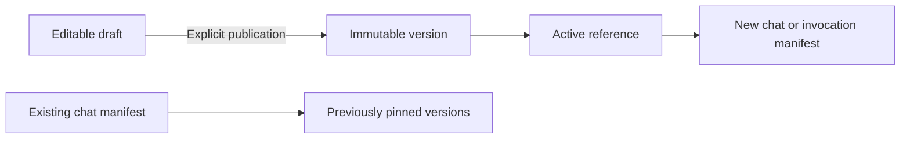

# Published AI prompts

AI instructions are maintained through `aiPromptTemplate` and `aiPromptVersion`.
Both entities are administrator-only, including direct generic API and MCP access.
The agent builder opens **AI-Prompts und Qualität**. The normal generic forms edit
the template's title, description and draft; publication uses `/api/ai/prompts`.

Both prompt entities define explicit `SaplingForm` visibility, ordering and widths
for tables, mobile lists and record dialogs. Templates show their key, title,
purpose, active version and update time; dialogs group fields into general data,
prompt content and publication. Published versions expose their source template,
version, content, placeholders, change note, author, publication time and checksum
as read-only fields. The draft uses the normal Markdown editor and preview.
The added evaluation, manifest, delivery-timing and rule-snapshot fields also have
explicit layouts. Long diagnostic JSON stays in forms rather than default tables.
`translationData_083.json` supplies the additional German and English labels.
These are UI metadata changes and require no database schema migration.

## Publication and runtime

`AiPromptService.publish` locks the template row in a database transaction, validates
the placeholder contract, creates the next immutable version, and moves the active
reference. Restoring a version creates another publication; it never rewrites history.
A PostgreSQL trigger also rejects direct changes to published content, variables,
version numbers, checksums and publication times, as well as deletion.

Only named `{{placeholders}}` are supported. All declared placeholders are required.
Unknown placeholders and expression-like syntax are rejected. Rendering substitutes
values once, so an email containing `{{something}}` cannot inject another template.
Tool schemas, permission checks, confirmation rules and permitted inbound-email
mutations remain enforced by code independently of the editable instructions.

New sessions pin a manifest before use. Existing sessions use their stored manifest.
For legacy sessions, a conditional database update pins the first subsequent invocation
once across backend instances. Earlier messages remain historically unreconstructable.
The resolver reads current active references for new scopes; it has no hidden fallback
to compiled instruction strings. Missing versions fail with a configuration error.

Inbound-email processing stores its manifest before AI processing, including its
corrective request and later retries. Import suggestions and Markdown revision store
dedicated `AiAgentRun` entries with manifests. Chat runs store the session manifest;
speech generation uses the owning session's manifest. Standalone MCP and record-action
requests establish a prompt scope, and nested operations inherit it. Standalone AI
record actions and MCP executions also persist a diagnostic run; ordinary record
actions and provider-list reads do not load the prompt catalogue. Speech payloads and
transcription request metadata retain version references. Prompt-management request
bodies are excluded from general HTTP error logs.

Numbered files in `database/seeder/prompts` install the original application texts.
The initial seed leaves existing templates untouched. Subsequent seed files can offer
updated drafts when no unpublished edits exist, and never change published references.
Add new numbered seed files; do not edit an executed seed to distribute updates.

## Workbench and evaluation

- Browse/search templates, edit/save drafts, render a preview with explicit context
  values, inspect previous versions, compare published text with the draft, publish,
  or restore.
- `GET /api/ai/prompts/:key/usage` shows the code locations using a template. The
  usage index and all 236 initial instruction fragments are checked against their
  call sites and placeholder contracts by the catalog test.
- The effective-context preview uses the selected agent and its existing version,
  playbook and memory services. Record-specific context is resolved on the actual run.
- Evaluation cases add `expectations` and `toolFixtures`. The admin endpoint
  `POST /api/ai/agents/:handle/evaluations/run` accepts 1–20 case handles and an optional
  complete historical prompt manifest. Reuse the same case checksum for comparisons.
- Supported expectations: `requiredTools`, `forbiddenTools`, `targetEntities`,
  `contains`, `forbiddenText`, `maxToolCalls`. Free-text `expectedCriteria` remain
  explicitly marked for manual review.
- The evaluation executor exclusively returns fixtures keyed by `server.tool` or
  tool name. Missing fixtures fail the test. It never invokes the live tool executor,
  including for mutations and external tools. AI provider calls still occur and consume
  provider tokens. Tests are bounded by iteration and provider timeout limits.
- Runs retain the manifest, test checksum, structured verdict, response, tool trace,
  duration and reported token usage. General usage telemetry refers to these runs and
  stores measurements; it does not copy the prompt library.

## Verification and rollout

Run the migration before deploying code that queries the new fields, then run the
normal seeder. No migration is applied automatically by the verification scripts.
`node backend/maintenance/verify-prompt-migration.cjs` verifies the compiled migration,
seeder, publication, restoration and immutable versions in a disposable local database.
It refuses non-local database hosts and never changes the supplied application's data.

The focused tests cover placeholder failures, parallel contexts, exact-version
resolution, fixture-only evaluations and direct administrator checks. The existing
MCP permission and tool-action suites remain part of the complete quality gate.
